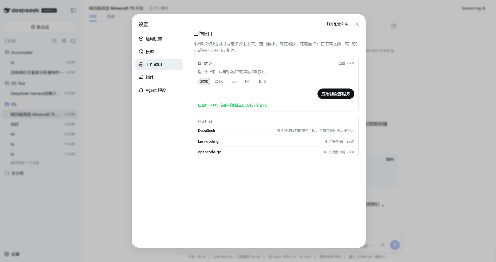

# dsh-operating-context

[English](README.md) | 中文

[DeepSeek Harness](https://github.com/deepseek-ai/deepseek-harness) 的设置页 **工作窗口**。它把每个已配置的模型服务限制到同一个工作上下文窗口——适配器、用量环和官方自动整理读的都是同一个 `contextWindow`——并且不会要求模型装下超过它能力的内容。

它**不会**再挂一套压缩引擎、不会包装 `resolveModel`，也不会用 bundle patch 去改适配器配置（那种 patch 会整行替换，密钥和接入点会被清掉）。全部通过用户层的 `settings.mutate` 写入。

GitHub 话题：[`dsh-plugin`](https://github.com/topics/dsh-plugin)。

兼容性基线：已按 DeepSeek Harness `0.1.0-rc.5`
（`47f943859bef60e4160492346772ded9b24f765a`，2026-08-14）核对。Harness
的插件接口目前仍处于候选发布阶段，升级到更新版本时应重新构建并测试本包。

## 安装

这是一个 DeepSeek Harness **组合包**。它不能单独运行；除非你自己把 `dsh` 放进 PATH，否则系统里没有这个命令。官方入口是 `npx @deepseek-ai/dsh`。

第一次使用需要：

1. [Node.js](https://nodejs.org/) `^22.19.0` 或 `>=24`
2. PATH 上有 [pnpm](https://pnpm.io/installation)（`corepack enable` 即可；`dsh plugin` 会转发给 pnpm）
3. 然后执行下面的命令。第一次 `npx @deepseek-ai/dsh web` 也会创建 `web` profile。

```sh
npx @deepseek-ai/dsh plugin --profile web add github:AIMFllyYS/dsh-operating-context
```

仓库已经提交经过审查的预构建 `lib/` 产物。安装时不会执行本包代码，也不需要修改 `allowBuilds`。不想让后续推送悄悄改变正在运行的内容，就钉死 commit：

```sh
npx @deepseek-ai/dsh plugin --profile web add github:AIMFllyYS/dsh-operating-context#<sha>
```

如果是从 DeepSeek Harness 源码 checkout 运行，把上面的 `npx @deepseek-ai/dsh` 换成 `pnpm dsh`：

```sh
pnpm dsh plugin --profile web add github:AIMFllyYS/dsh-operating-context
```

从本插件的 checkout 安装：

```sh
pnpm install
pnpm bundle
npx @deepseek-ai/dsh plugin --profile web add .
```

确认该层已经挂上，再启动 Web UI：

```sh
npx @deepseek-ai/dsh --profile web --dump-config   # 应出现 "# == dsh-operating-context" 层
npx @deepseek-ai/dsh web                           # 仍是 3080 端口
```

安装后打开 **设置 → 工作窗口**（在「模型」和「插件」之间）。那一页就是这个插件：



选一个大小并应用。模型、用量环和官方自动整理会通过设置事件跟着变。退出再重新进入本设置页时，页面会从各路由共同保存的 `defaultContextWindow` 恢复上次选择；下方仍会如实显示被模型原生上限压低的结果，这些差异不会再让已保存的选择消失。

一次应用可能跨越多个设置命名空间，而 Harness 的写入以单个命名空间为单位，并不是跨命名空间事务。如果前面的批次已经成功、后面的批次失败，页面会明确显示实际完成的批次数，并重新读取权威设置状态；不会把部分写入说成已经回滚，也不会继续展示写入前的旧快照。

卸载：

```sh
npx @deepseek-ai/dsh plugin --profile web remove dsh-operating-context
```

已经写入的值会留在 `~/.dsh/settings.yaml`；卸插件不会自动还原。当所选窗口达到目录模型已知的原生上限时，本插件会清掉该模型的容量覆盖，让原生值重新生效。上限未知的路由和显式 `models` 列表不能这样还原。

如果权威目录已经不存在某个模型，但配置里还留着它的 `modelOverrides`
条目，适配器会拒绝这个旧条目，并可能导致整条路由不可用。页面会在应用前明确显示将清理多少个这类条目；目录上限未知时绝不会执行这项清理。

## 安装故障排查

如果旧版本通过 Git 安装时出现 frozen lockfile、`autoInstallPeers` 或
`allowBuilds` 报错，不要通过修改使用者 profile 的 pnpm 策略来强行编译那个旧版本。Git 包管理器会把 `build`、`prepare`、`prepack`、`preinstall`、`install` 和 `postinstall` 中任意一个脚本视为“需要在安装前构建”的信号。当前版本已经包含编译好的 `lib/`，并且没有定义这些 Git 构建触发脚本。

安装前可以在 checkout 中检查：

```sh
node -e "const p=require('./package.json'); for (const s of ['build','prepare','prepack','preinstall','install','postinstall']) if (p.scripts?.[s]) process.exit(1)"
test -f lib/index.js && test -f lib/client.js && test -f lib/client.js.map
```

PowerShell 使用：

```powershell
$p = Get-Content -Raw package.json | ConvertFrom-Json
foreach ($name in 'build','prepare','prepack','preinstall','install','postinstall') {
  if ($p.scripts.$name) { throw "$name must not be present in a Git-distributed package" }
}
Get-Item lib/index.js, lib/client.js, lib/client.js.map
```

本包的本地 `pnpm-workspace.yaml` 用于避免单独开发时自动安装可选的
Harness peer；项目开发仍以 pnpm 为准。

## 它写什么

容量拼写与「模型」页一致：**256K = 256000**，不是 262144。

写入位置随 profile 的形态而定，因为适配器解析容量的顺序是 `entry.contextWindow ?? catalog.contextWindow ?? defaultContextWindow`：

| 路由形态 | 写入内容 |
| --- | --- |
| 目录路由且没有 `models` 列表 | `modelOverrides.<id>.contextWindow`，外加 `defaultContextWindow` |
| 任何带 `models` 列表的路由 | 每一个 `models[].contextWindow`，外加 `defaultContextWindow` |
| 手写声明路由 | 只写 `defaultContextWindow` |

这就是为什么只写 `defaultContextWindow` 对目录路由没有效果：目录自带的值优先级更高。

## 上限

模型不会被写成超过它能装下的窗口。上限来自多提供方适配器的内置目录，通过 `llm.discoverModels` 读取；对目录路由这条调用走本地数据，不发网络、不用凭据。手写声明路由，以及没有注册 discovery 的 `llm-deepseek`，上限未知，页面会照实说明，而不是猜一个数。

所选窗口已经处在或低于某模型上限时，不写覆盖，并清掉以前写过的覆盖——目录值本来就是对的。这让应用幂等，也让选更大的窗口能恢复原生容量。

## 供应商兼容性

算法没有供应商名称白名单。OpenCode、Kimi Coding、Anthropic 以及其他
`llm-pi-ai` 内置目录路由都遵循同一套 Harness 目录契约，统一使用本地目录上限和
`defaultContextWindow`/`modelOverrides` 规划；以后 Harness 增加遵循相同契约的目录供应商时，不需要在插件里再写名称分支。

手工声明或私有网关不会在打开本页时被自动探测，因为 discovery 可能访问用户端点并要求凭据。如果路由有显式 `models` 列表，插件只更新每行的 `contextWindow`，并保留端点、协议、凭据引用、模型名称、输出上限和未知元数据；没有列表时只写 `defaultContextWindow`。这类路由的原生上限保持“未知”，界面不会猜测。

完全独立的新 Harness adapter 只有在它公开的设置路由也遵循上述容量结构时才兼容。当前 Harness 目录没有为任意未来 schema 提供通用的容量能力标志，因此插件不能承诺对不公开 `defaultContextWindow`、`models` 或目录 discovery 的 adapter 进行模型级限幅。

## 开发

```sh
pnpm install
pnpm typecheck
pnpm test
pnpm bundle
npm pack --dry-run
```

`src/index.ts` 是 Host 侧的 loader stub；行为都在客户端 bundle 里。`api.ts`、`capacity.ts`、`ceiling.ts`、`plan.ts` 是纯逻辑并承担测试；只有 `store.ts` 和组件会碰到平台模块。

`lib/` 是需要提交的分发产物。修改 `src/` 后必须重新构建，并在同一个 commit 中包含 `lib/index.js`、`lib/client.js` 和 `lib/client.js.map`。使用者不应再承担任何安装期构建。

发布或推送候选版本前，应执行上述检查。如果改动过构建工具，再连续构建两次，并确认第二次构建后 `git status` 仍然干净。CSS Modules 的导出映射会主动排序，因此相同源码应生成字节完全一致的客户端产物。
